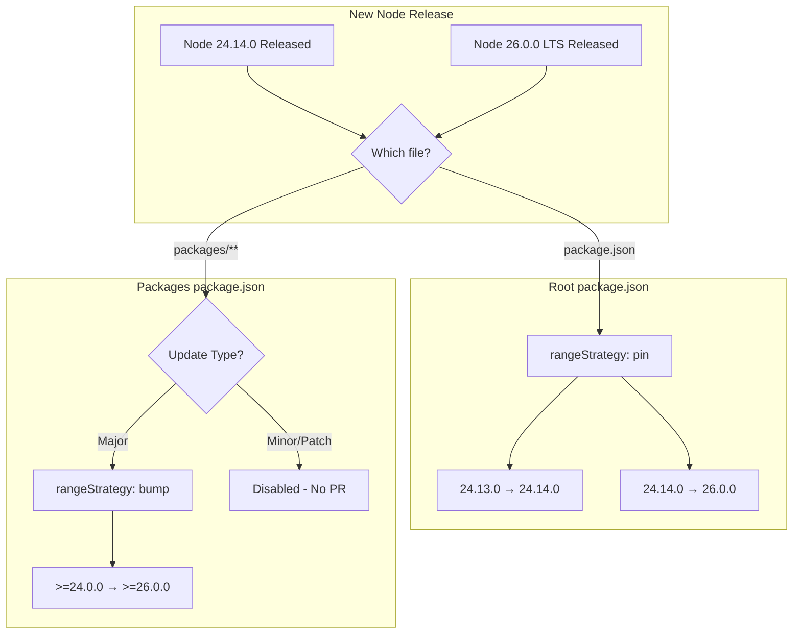

# Renovate Node Version Configuration

## 現状

| ファイル | 現在の値 | 目標 |

|----------|----------|------|

| `package.json` (root) | `24.13.0` | ピンバージョン、最新版に随時更新 |

| `packages/eslint-config/package.json` | `>=24.0.0` | メジャー縛り、LTSのみ更新 |

## 設定方針

### 1. ルートの package.json

- `rangeStrategy: "pin"` でピンバージョン形式を維持
- 最新のNodeバージョンがリリースされるたびに更新（例: `24.13.0` → `24.14.0` → `26.0.0`）

### 2. パッケージ配下の package.json

- `rangeStrategy: "bump"` で範囲形式の下限を更新
- `versioning: "node"` でNode.jsのLTSスケジュールを認識（奇数メジャーは不安定として扱われる）
- `matchUpdateTypes: ["major"]` のみ有効化し、minor/patchは無効化
- 結果: LTSのメジャーバージョンが出るたびに `>=24.0.0` → `>=26.0.0` のように更新

## matchDepTypes vs matchDepNames

| マッチャー | マッチ対象 | 例 |

|-----------|-----------|-----|

| `matchDepTypes` | 依存関係の**タイプ** | `dependencies`, `devDependencies`, `engines` |

| `matchDepNames` | 依存関係の**名前** | `node`, `react`, `typescript` |

`engines.node` を正確に指定するには**両方を組み合わせる**:

```json
{
  "matchDepTypes": ["engines"],
  "matchDepNames": ["node"]
}
```

## 設定内容

[.github/renovate.json](.github/renovate.json) を以下のように更新:

```jsonc
{
  "$schema": "https://docs.renovatebot.com/renovate-schema.json",
  "extends": ["github>nozomiishii/renovate"],
  "packageRules": [
    {
      "description": "Root: Pin version, update to latest Node",
      "matchFileNames": ["package.json"],
      "matchManagers": ["npm"],
      "matchDepTypes": ["engines"],
      "matchDepNames": ["node"],
      "rangeStrategy": "pin"
    },
    {
      "description": "Packages: Use node versioning for LTS awareness",
      "matchFileNames": ["packages/**/package.json"],
      "matchManagers": ["npm"],
      "matchDepTypes": ["engines"],
      "matchDepNames": ["node"],
      "versioning": "node",
      "rangeStrategy": "bump"
    },
    {
      "description": "Packages: Major updates only for node engines",
      "matchFileNames": ["packages/**/package.json"],
      "matchManagers": ["npm"],
      "matchDepTypes": ["engines"],
      "matchDepNames": ["node"],
      "matchUpdateTypes": ["minor", "patch"],
      "enabled": false
    }
  ]
}
```

## 動作の流れ



## 注意点

- `versioning: "node"` を使用することで、Renovateは奇数メジャーバージョン（19, 21, 23, 25）を不安定として扱い、LTSの偶数メジャーのみを安定版として認識する
- ルートは全ての更新を受け取り、パッケージ配下はLTSのメジャー更新のみを受け取る
- 将来、他のパッケージに `engines.node` を追加した場合も自動的に同じルールが適用される
